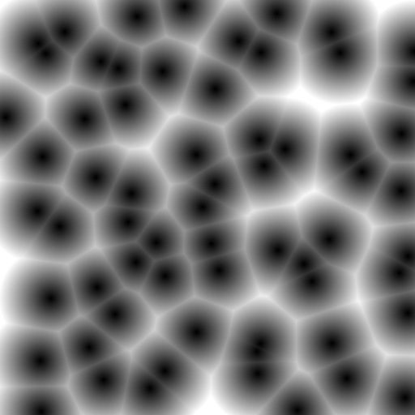
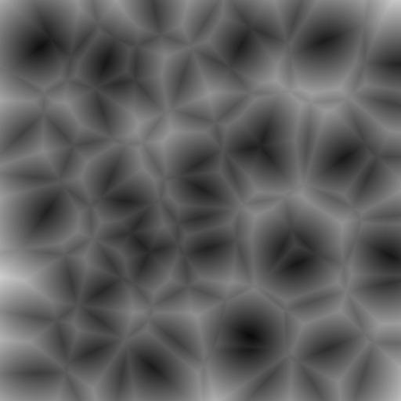
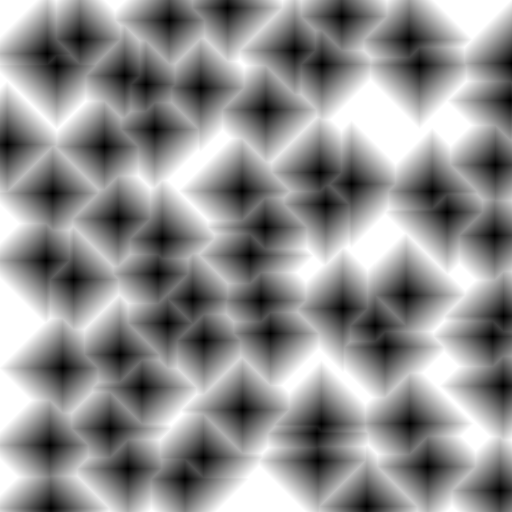
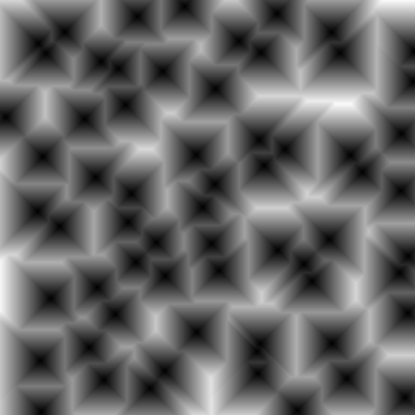
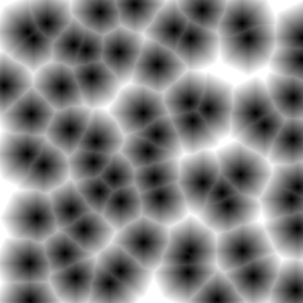

# Noise Characteristics

## Cells and Crystals

Calculating the distance based on the closest point produces a somewhat organic
cell-like pattern.

Switching to the second closest point produces a more crystalline texture.

## Distance Function

Other distance functions can be employed to provide a different character; Using
the taxi-cab distance gives rise to more cubic features.

A similar, 45° rotation, can be obtained by taking the maximum of either the
horizontal, or vertical, distance.

Taking the average of these two results in a texture which is similar to the
standard Euclidean distance but with rougher boundaries.

