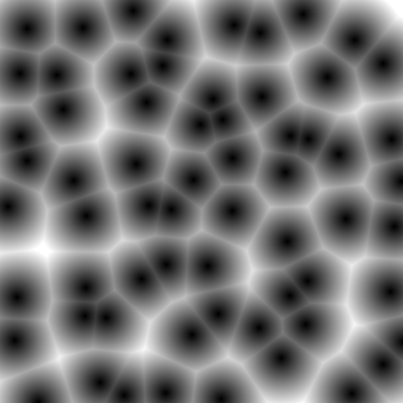

# Worley Noise

https://en.wikipedia.org/wiki/Worley_noise

A basic Worley Noise algorithm is as follows:-
- the grid is split into evenly sized cells
- a point is generated within each cell
- for each pixel, the distance to the closest point is calculated

